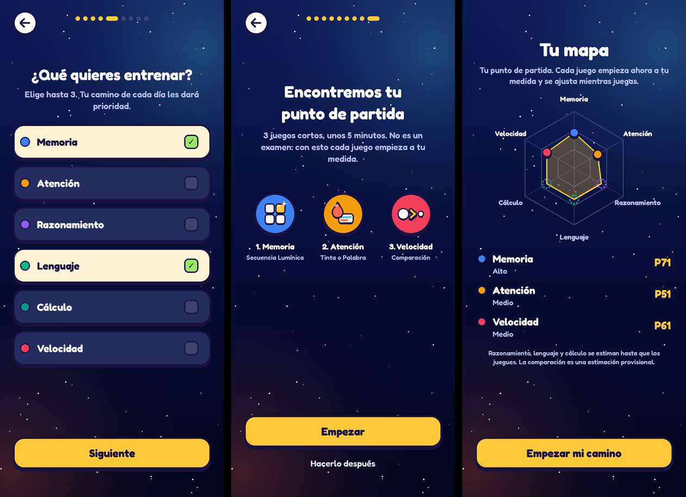
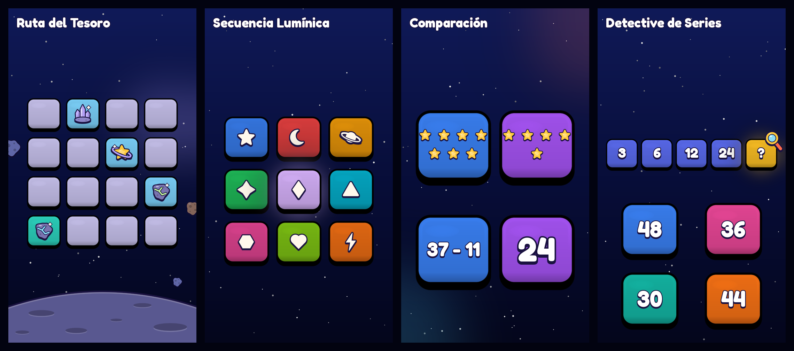
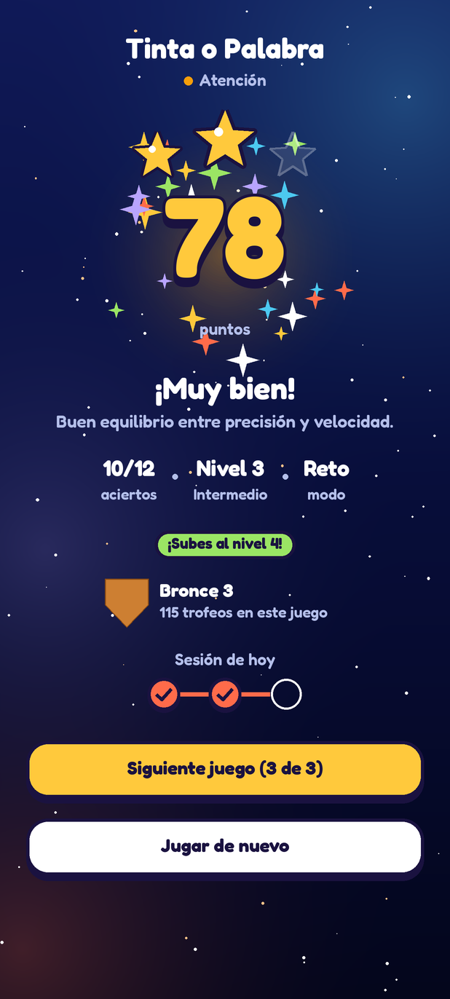

<div align="center">


# NeuroVida

**Entrenamiento cognitivo diario: 9 juegos cortos, 6 dominios, una dificultad que se ajusta a ti.**

App Android (Kotlin + Jetpack Compose) con los juegos en Unity embebido. En desarrollo activo.

</div>

---

## Qué es

Cada día NeuroVida propone un camino de 3 juegos (unos 5 minutos) elegidos según tus metas y el dominio que más
lo necesita. Cada juego sube o baja la dificultad mientras juegas para mantenerte en el punto justo: ni muy fácil,
ni imposible. Las partidas suman trofeos para subir de liga (de Bronce a Maestro), mantener la racha y desbloquear
logros que se pueden compartir.

Al empezar, un onboarding corto pregunta nombre, edad, nivel educacional, metas y días por semana, y ofrece una
evaluación de 3 juegos ("Tu punto de partida") para que cada juego arranque a tu medida.

Todo se guarda en el teléfono; no hace falta cuenta ni conexión.

<table>
<tr>
<td align="center" width="33%"><br/>Metas, evaluación y mapa inicial</td>
<td align="center" width="33%"><br/>Arte propio de los juegos</td>
<td align="center" width="33%"><br/>Resultado de una partida</td>
</tr>
</table>

Las imágenes de `docs/previews/` son vistas previas generadas desde el código (ver `tools/`), no capturas.

## Los 9 juegos

| Juego | Dominio | Qué hace |
|---|---|---|
| Secuencia Lumínica | Memoria | Repetir secuencias de fichas que se encienden, cada vez más largas |
| Parejas Ocultas | Memoria | Memorizar un tablero de cartas y encontrar las parejas |
| Ruta del Tesoro | Memoria | Recordar dónde aparecieron los tesoros en un mapa lunar |
| Tinta o Palabra | Atención | Responder al color de la tinta o a la palabra, según la regla del momento |
| Cambio de Chip | Atención | Seguir hacia dónde apunta la nave o dónde está, según la regla |
| Detective de Series | Razonamiento | Encontrar el número que sigue en una serie |
| Anagramas | Lenguaje | Ordenar letras para formar una palabra |
| Cálculo Sereno | Cálculo | Resolver cuentas antes de que la burbuja toque el agua |
| Comparación | Velocidad | Elegir el lado mayor lo más rápido posible |

Cada juego tiene modo **Reto** (contra reloj) y **Precisión** (sin reloj).

## Cómo está hecho

```
app/                     App Android (Kotlin + Compose)
  src/main/java/com/example/
    MainActivity.kt, viewmodel/, data/ (Room + lógica pura), ui/ (pantallas y componentes), bridge/ (puente con Unity)
  schemas/               Esquemas de Room (migraciones)
unity/NeuroVidaCore/     Proyecto Unity con los 9 juegos (Assets/Scripts)
unity/AndroidExport/     Librería Android exportada desde Unity (fuera de git; se regenera)
tools/                   Verificación completa, chequeo de C# sin Unity y vistas previas del arte
docs/                    DDA común, historial de desarrollo, vistas previas
```

- **App**: Jetpack Compose con Material 3, un ViewModel con `StateFlow`, Room para el progreso, WorkManager para el
  recordatorio diario, Moshi para el JSON del puente.
- **Juegos**: Unity 6 (6000.0.84f1). La interfaz de cada juego se arma por código y el arte se dibuja por código
  (sprites de "arcilla" generados con campos de distancia). Siete juegos comparten un motor de dificultad adaptativa
  ([`docs/DDA-comun.md`](docs/DDA-comun.md)); Secuencia y Parejas tienen el suyo.
- **Puente**: la app abre Unity con la configuración de la partida en el Intent; Unity devuelve el resultado en JSON
  y la app lo guarda y muestra la pantalla de resultado. Unity queda vivo entre partidas para que abran al instante.

Detalle técnico y reglas del proyecto: [`CLAUDE.md`](CLAUDE.md).

## Compilar y probar

Requisitos: Android SDK (android-36), JDK 21 (Temurin) y Unity 6000.0.84f1 con soporte Android.

```bash
# Todo en uno: pruebas de Unity, arranque de los 9 juegos, exportar Unity, compilar la app, pruebas Kotlin e instalar
bash tools/verificar-todo.sh --instalar
```

Si solo cambió el código Kotlin: `./gradlew assembleDebug` y `./gradlew testDebugUnitTest`. Si cambió algo de Unity,
hay que reexportar la librería (`NeuroVida > Exportar como librería Android` en el Editor) antes de compilar la app;
si no, el APK lleva los juegos anteriores.

Sin Unity instalado se puede comprobar que el C# compila: `dotnet build tools/unity-compile-check -v q`.
