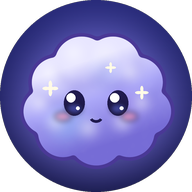
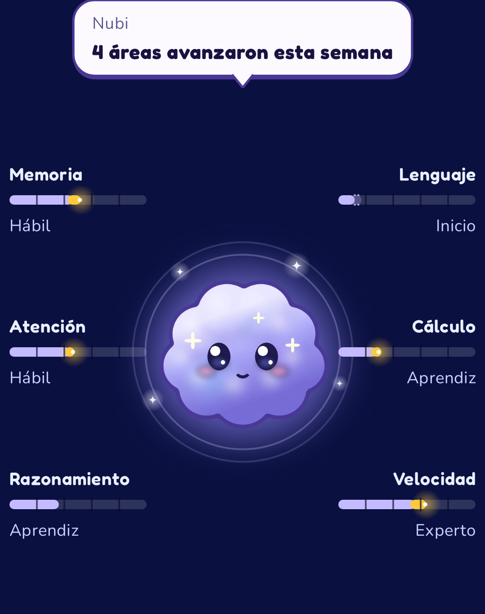
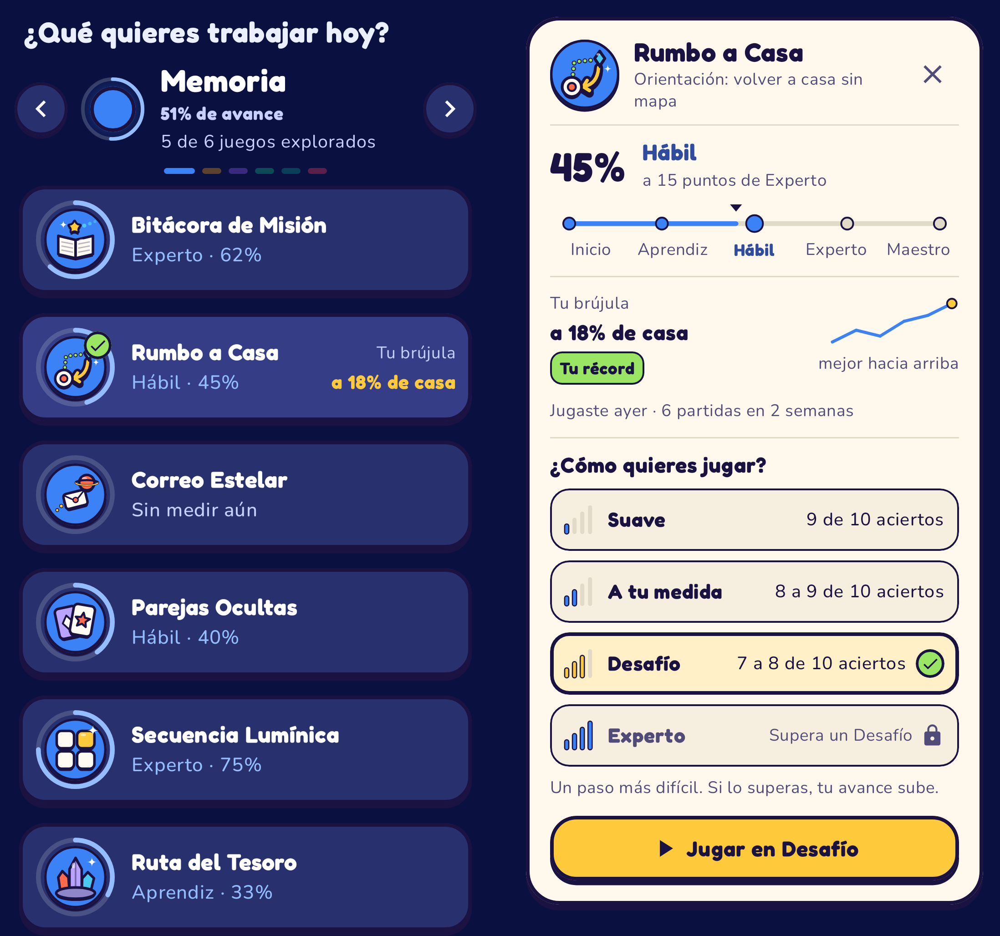

<div align="center">



# Nubi

**entrenamiento cognitivo diario: 19 juegos cortos, 4 áreas y una dificultad que se ajusta a ti.**

App Android (Kotlin + Jetpack Compose) con los juegos en Unity embebido. En desarrollo activo, todavía sin publicar.

</div>

---

## Qué es

Nubi es una nube pequeña donde nacen las estrellas: acompaña tu práctica diaria y cada partida hace nacer una.
La app propone cada día un camino de 3 juegos (unos 5 minutos), elegidos según tus metas y el área que más lo
necesita. Cada juego sube o baja la dificultad mientras juegas para mantenerte en el punto justo: ni muy fácil, ni
imposible, y se ajusta a la edad de quien juega. Las partidas suman trofeos para subir de liga (de Bronce a Maestro),
mantener la racha y desbloquear logros que se pueden compartir.

Al empezar, un onboarding corto pregunta nombre, edad, nivel educacional, metas y días por semana, y ofrece una
evaluación de 3 juegos ("Tu punto de partida") para que cada juego arranque a tu medida.

Todo se guarda en el teléfono; no hace falta cuenta ni conexión.

<table>
<tr>
<td align="center" width="50%"><br/><b>Hoy</b>: Nubi al centro, con tu avance en cada una de las 6 áreas</td>
<td align="center" width="50%"><br/><b>Juegos</b>: todos los de un área en lista y su ficha al tocar</td>
</tr>
</table>

Estas dos son capturas reales de la app. El resto de las imágenes de `docs/previews/` son vistas previas generadas
desde el código (ver [`docs/previews/README.md`](docs/previews/README.md)).

## Cómo se usa

| Pestaña | Qué hay |
|---|---|
| **Hoy** | Nubi al centro y, alrededor, las 4 áreas (Memoria, Atención, Razonamiento y Lenguaje) con una barra de avance y su etapa (Inicio, Aprendiz, Hábil, Experto, Maestro). La barra muestra lo que avanzó esta semana. Al tocar un área se abre su detalle y Nubi propone el juego que más le conviene |
| **Juegos** | "¿Qué quieres trabajar hoy?": eliges un área y ves todos sus juegos en lista. Al tocar uno se abre su ficha: tu avance, tu última marca y cómo quieres jugar. Al terminar vuelves a la misma casilla |
| **Entrenar** | El botón central: la sesión del día, 3 juegos seguidos |
| **Liga** | Tu liga, tus trofeos y cómo vas en cada juego |
| **Perfil** | Logros, punto de partida y ajustes |

Cada juego se puede jugar en cuatro modos: **Suave**, **A tu medida**, **Desafío** y **Experto** (se abre al superar un
Desafío). Solo las partidas a tu medida y los desafíos superados mueven tu avance. Cómo se calcula:
[`docs/dificultad-y-avance.md`](docs/dificultad-y-avance.md).

## Los 19 juegos

Los marcados con ★ son **juegos estrella**: además del puntaje, al final muestran una medida propia de esa partida
(por ejemplo "tu freno", "tu seguimiento" o "tu brújula interna"), con su respaldo en
[`docs/medidas-juegos-estrella.md`](docs/medidas-juegos-estrella.md). Son medidas de esa partida, no un diagnóstico.

| Juego | Área | Qué hace |
|---|---|---|
| Secuencia Lumínica | Memoria | Repetir secuencias de fichas que se encienden, cada vez más largas |
| Parejas Ocultas | Memoria | Memorizar un tablero de cartas y encontrar las parejas |
| Rumbo a Casa ★ | Memoria | Volver a la base sin verla, sabiendo solo el camino que hiciste |
| Correo Estelar ★ | Memoria | Acordarte de entregar un encargo o avisar por radio en el momento justo, mientras vuelas |
| Bodega de carga ★ | Memoria | Recordar dónde guardó cada cosa el robot en una bodega redonda: la carga entra por la esclusa, a veces cambia una caja de lugar y a veces la bodega gira |
| Tinta o Palabra | Atención | Responder al color de la tinta o a la palabra, según la regla del momento |
| Piloto Estelar ★ | Atención | Guiar una nave con un pulgar y atrapar señales con el otro |
| Freno de Emergencia ★ | Atención | Lanzar cohetes rápido, pero frenar a tiempo cuando aparece el ¡ALTO! |
| Satélites ★ | Atención | Seguir varios satélites en movimiento y señalar cuáles eran |
| Acoplamiento ★ | Razonamiento | Decidir si un módulo girado encaja en el puerto o es su reflejo |
| En la punta de la lengua | Lenguaje | Encontrar la palabra que describe una definición y armarla con letras; una escalera de ayudas evita trabarse |
| Lluvia de meteoros ★ | Lenguaje | Tocar las palabras que existen y dejar pasar las inventadas, mientras caen en meteoros |
| ¿Verdad o disparate? ★ | Lenguaje | Leer frases cortas que llegan por radio y decidir rápido si son verdad o un disparate |
| Cosecha de palabras ★ | Lenguaje | Formar palabras con 7 letras que giran alrededor de un planeta; cada palabra brota como una planta de tu huerto |
| La estrella intrusa ★ | Lenguaje | Cinco palabras en estrellas, una no pertenece: tócala y una chispa dibuja la figura de lo que las une para tu atlas |
| Carga exacta | Razonamiento | Juntar celdas de energía de a dos (+ − × ÷) hasta llegar a la carga exacta del reactor |
| Aterrizaje Lunar ★ | Razonamiento | Aterrizar el módulo justo en un número de una regla |
| Radar ★ | Atención | Ver un destello y decir dónde estaban los astronautas |

Cada juego tiene modo **Reto** (contra reloj) y **Precisión** (sin reloj); se elige en Ajustes.

## Cómo está hecho

```
app/                     App Android (Kotlin + Compose)
  src/main/java/com/example/
    MainActivity.kt, viewmodel/, data/ (Room + lógica pura), ui/ (pantallas y componentes), bridge/ (puente con Unity)
  schemas/               Esquemas de Room (migraciones)
unity/NeuroVidaCore/     Proyecto Unity con los juegos (Assets/Scripts; Bitácora de Misión, retirada de la app, sigue ahí)
unity/AndroidExport/     Librería Android exportada desde Unity (fuera de git; se regenera)
tools/                   Verificación completa, chequeo de C# sin Unity y vistas previas del arte
docs/                    Documentación (ver docs/README.md) y vistas previas
```

- **App**: Jetpack Compose con Material 3, un ViewModel con `StateFlow`, Room para el progreso, WorkManager para el
  recordatorio diario, Moshi para el JSON del puente. Diseño "noche + arcilla" con Fredoka (títulos) y Nunito (texto).
- **Juegos**: Unity 6 (6000.0.84f1). La interfaz de cada juego se arma por código y el arte se dibuja por código
  (sprites de "arcilla" generados con campos de distancia). La mayoría comparte un motor de dificultad adaptativa
  ([`docs/DDA-comun.md`](docs/DDA-comun.md)); Secuencia y Parejas tienen el suyo.
- **Puente**: la app abre Unity con la configuración de la partida en el Intent; Unity devuelve el resultado en JSON
  y la app lo guarda y muestra la pantalla de resultado. Unity queda vivo entre partidas para que abran al instante.
- **Accesibilidad**: letra pensada para adultos mayores (14 sp o más en las pantallas principales), respeta "quitar
  animaciones", sonido y vibración apagados, y el acierto o el error nunca se indican solo con color.

El nombre público es **Nubi**. Dentro del código, los paquetes y el proyecto de Unity se siguen llamando NeuroVida.
Detalle técnico y reglas del proyecto: [`CLAUDE.md`](CLAUDE.md).

## Compilar y probar

Requisitos: Android SDK (android-36), JDK 21 (Temurin) y Unity 6000.0.84f1 con soporte Android.

```bash
# Todo en uno: pruebas de Unity, arranque de los juegos de Unity, exportar Unity, compilar la app, pruebas Kotlin e instalar
bash tools/verificar-todo.sh --instalar
```

Son más de 180 pruebas de Unity, una prueba de arranque por juego y más de 120 pruebas de Kotlin. En GitHub, cada subida
de código compila el C# sin Unity y la app con sus pruebas Kotlin (pestaña Actions).

Si solo cambió el código Kotlin: `./gradlew assembleDebug` y `./gradlew testDebugUnitTest`. Si cambió algo de Unity,
hay que reexportar la librería (`NeuroVida > Exportar como librería Android` en el Editor) antes de compilar la app;
si no, el APK lleva los juegos anteriores.

Sin Unity instalado se puede comprobar que el C# compila: `dotnet build tools/unity-compile-check -v q`.
Para compilar y probar solo la app en un entorno sin Unity: `bash tools/nube-compilar-app.sh`.

Lista para recorrer la app completa en el teléfono antes de marcar una versión: [`docs/prueba-manual.md`](docs/prueba-manual.md).

## Cuidado de los datos y calidad

- **Tu progreso se respalda.** Las partidas, el avance de cada juego, la liga y los logros van en el respaldo automático
  de Android, así que un teléfono nuevo los recupera. No se respalda lo pasajero (una partida en pausa, por ejemplo).
- **Las actualizaciones no borran el progreso.** Hay pruebas de migración de la base de datos: si un cambio de versión no
  trae su migración, el error aparece al probar y no en el teléfono de una persona.
- **Si algo falla, queda anotado.** Los cierres inesperados y los resultados de un juego que no se pudieron leer se guardan
  en el teléfono; en Ajustes, "Enviar informe de errores" los comparte como texto, sin nombre ni resultados.
- **Cada subida se verifica sola.** En GitHub, la pestaña **Actions** muestra la ejecución "Verificar" de cada commit: dos
  marcas verdes = el C# de los juegos y la app con sus pruebas compilan bien. No reemplaza a `verificar-todo.sh`, que
  además corre las pruebas de Unity, el arranque de los juegos de Unity y el export.
- **Lo que falta mejorar** (medidas genéricas de los juegos, idiomas, versión de tienda...) está con pasos concretos en
  [`docs/plan-mejoras-arquitectura.md`](docs/plan-mejoras-arquitectura.md).

## Versiones

Las versiones marcadas están en las etiquetas de git: `v0.1-base` (primer punto base aprobado) y `v0.2` (con los
primeros juegos estrella).
